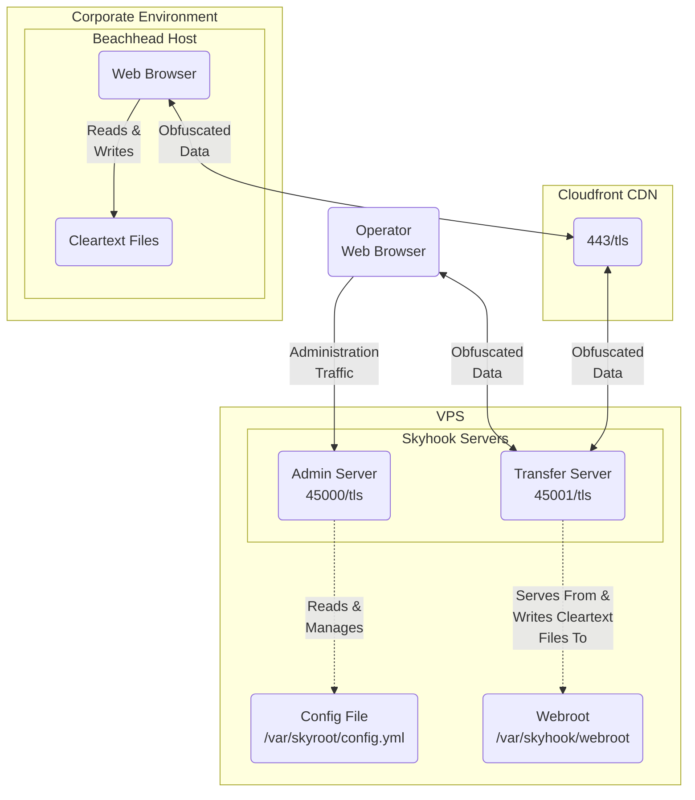

# Skyhook

Skyhook is a REST-driven utility used to smuggle files into and out of networks
defended by IDS implementations. It comes with a pre-packaged web client that uses
a blend of React, vanilla JS, and web assembly to manage file transfers.

# Key Links

- [Download here](https://github.com/blackhillsinfosec/skyhook/releases)
- See the [user documentation](https://publish.obsidian.md/bhis-pub-user-docs/Documentation/Skyhook/Skyhook+Index)
  to get started

# Features

- Round trip file content obfuscation
- User-configurable obfuscation chaining
- Self-signed and Lets Encrypt certificate procurement methods
- Embedded web applications for both configuration and file transfers.
- Server fingerprinting resiliency techniques:
    - Encrypted loaders capable of dynamically encrypting interface files as the file transfer interface is rendered
    - API and web resource path randomization

# Brief Description

_Note:_ See the [user documentation](https://publish.obsidian.md/bhis-pub-user-docs/Documentation/Skyhook/Skyhook+Index)
for more thorough discussion of Skyhook and how it functions.

Skyhook's file transfer server seamlessly obfuscates file content
with a user-configured series of obfuscation algorithms prior to
writing the content to response bodies. Clients, which are configred
with the same obfuscation algorithms, deobfuscate the file content
prior to saving the file to disk. A file streaming
technique is used to manage the HTTP transactions in a chunked manner,
thus facilitating large file transfers.

# A Brief Example

For example, here is a working obfuscation configuration:

And here is the file transfer interface. Clicking "Download" results in the file
being retrieved in chunks that are encrypted with the chain of obfuscation methods
configured above.

JavaScript deobfuscates the file before prompting the user to save it to disk.

Below is a request stemming from a download being inspected with Burp. Key elements
of the transaction are encrypted to evade detection.

