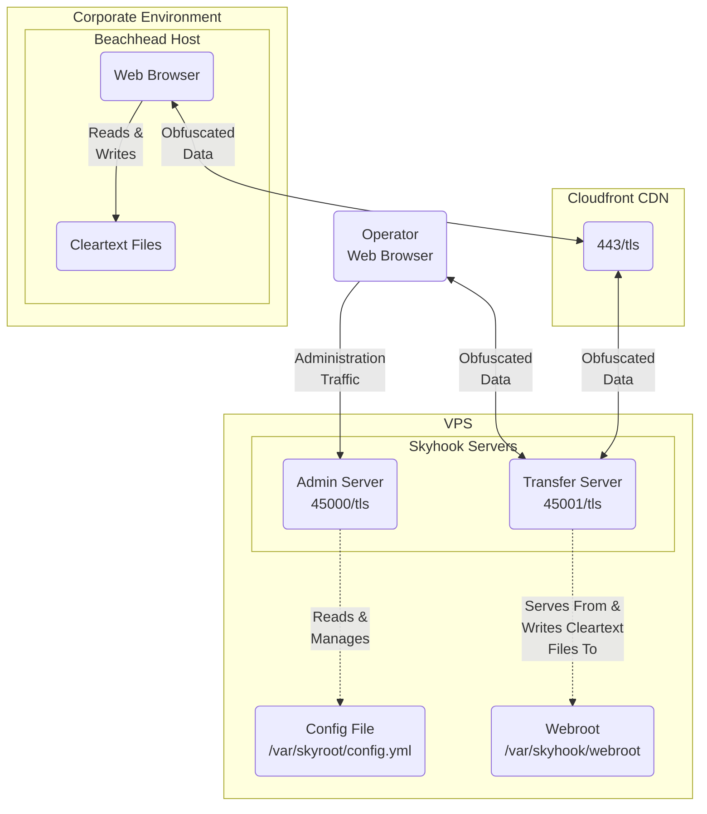

# Skyhook

Skyhook is a utility used to smuggle files into and out of networks
defended by perimeter controls that inspect and act on traffic
perceived to contain malicious content.

# Key Links

- See the [user documentation](https://publish.obsidian.md/bhis-pub-user-docs/Documentation/Skyhook/Skyhook+Index)
  to get started using it.
- [Download here](https://github.com/blackhillsinfosec/skyhook/releases).

# Features

- Round trip file content obfuscation
- User-configurable obfuscation chaining
- Self-signed and Lets Encrypt certificate procurement methods
- Embedded web applications for both configuration and file transfers.
- Server fingerprinting resiliency techniques:
    - Encrypted loaders capable of dynamically encrypting interface files as the file transfer interface is rendered
    - API and web resource path randomization

# Brief Description

_Note:_ See the [user documentation](https://publish.obsidian.md/bhis-pub-user-docs/Documentation/Skyhook/Skyhook+Index)
for more thorough documentation.

Skyhook's file transfer server seamlessly obfuscates file content
with a user-configured series of obfuscation algorithms prior to
writing the content to response bodies. Clients, which are configred
with the same obfuscation algorithms, deobfuscate the file content
prior to saving the file to disk. A file streaming
technique is used to manage the HTTP transactions in a chunked manner,
thus facilitating large file transfers.

